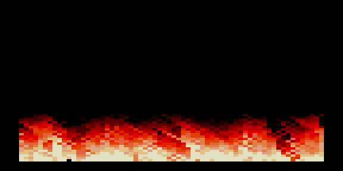

# fire2 — огонь 64×64 → 256×256



Развитие [демо `fire`](../fire): тепловая карта огня считается в маленьком
буфере 64×64 и растягивается на весь экран 256×256. Пламя получается крупным,
сплошной стеной внизу экрана, а стоимость кадра — в ~16 раз ниже, чем при
расчёте в полном разрешении.

- Режим: 256×256, 16 цветов (градиент пламени).
- Горячий путь (расчёт + рендер с гонкой за лучом) — на ассемблере в `fire.asm`.
- Подробный разбор оптимизаций и бюджетов кадров — в [OPTIMIZATION.MD](OPTIMIZATION.MD).

## Сборка

```bash
make          # собрать fire2.rom
make deploy   # собрать + положить в ROMS эмулятора PPSSPP
make full     # clean + deploy
```

Тот же движок огня используется в демо-ROM [`../../musics/mk`](../../musics/mk)
(огонь + тема Mortal Kombat).
