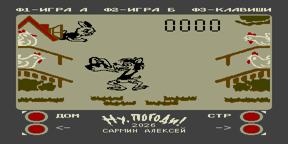

# Ну, погоди! — игра для Вектора-06Ц



Порт знаменитой советской игры «Ну, погоди!» (волк ловит яйца, которые несут
курицы по четырём жёрдочкам). Экран 256×256, 16 цветов; спрайты и фон собраны
из растра в бит-плоскости VRAM.

## Управление

| Клавиша | Действие |
|---------|----------|
| Ф1 | ИГРА А |
| Ф2 | ИГРА Б |
| Ф3 | НАЗНАЧИТЬ КЛАВИШИ |
| ← / → (стрелки) | перевод волка между позициями |

В меню играет мелодия заставки (`title.mid` → `src/title_music.inc`), ударные
идут на Tape Out (ВИ53-сборка) или Noise C (AY-сборка).

## Звук — два варианта сборки

| ROM | Тональные каналы | Ударные |
|-----|------------------|---------|
| `nu_pogodi.rom`    | КР580ВИ53 | Tape Out (PC0) |
| `nu_pogodi_ay.rom` | AY-3-8910 | Noise C |

## Сборка

```bash
make            # собрать оба ROM
make assets     # создать src/screen.bmp и src/sprites/*.bmp из атласа (bootstrap)
make inc        # bg.inc + sprites.inc из BMP
make music      # src/title_music.inc из src/sounds/title.mus
```

Ассеты правятся в GIMP (`src/screen.bmp`, `src/sprites/*.bmp`), сборка ROM их
не перезаписывает. Подробности по спрайтам — [SPRITES.md](SPRITES.md), тесты —
[TEST.md](TEST.md).
