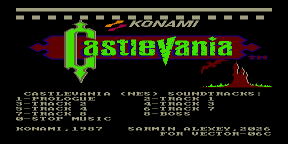

# castlevania — саундтрек Castlevania (NES)



Музыкальный ROM: саундтрек из NES-игры **Castlevania** (Konami, 1987).
9 треков, выбор с клавиатуры в меню.

| Клавиша | Трек |
|---------|------|
| 1 | Prologue |
| 2–6 | Track 1–5 |
| 7 | Track 7 |
| 8 | Track 8 |
| 9 | Boss |
| 0 | Стоп |

Звук: 3 тональных канала КР580ВИ53 + ударные AY-3-8910 (Noise C), всё
синхронно от кадрового прерывания 50 Гц. Партитуры сжаты **ZX0** и
распаковываются в ОЗУ перед игрой.

## Варианты сборки

| ROM | Тон | Ударные |
|-----|-----|---------|
| `castlevania.rom`     | КР580ВИ53 | Tape Out (PC0) |
| `castlevania_ay.rom`  | AY-3-8910 | Noise C |

## Сборка

```bash
make          # собрать ROM
make deploy   # собрать + положить в ROMS эмулятора PPSSPP
make full     # clean + deploy
```

Данные треков и конфигурация меню — в `rom.json`; общие правила — в
`../soundtracks/soundtrack.mk`.
