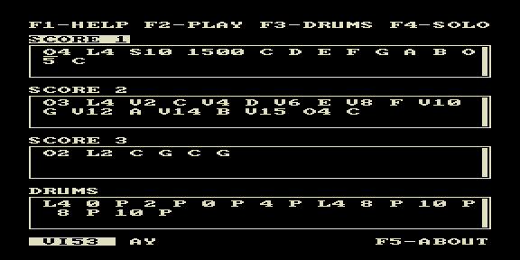

# composer — «Композитор»: редактор партитур на ROM



Приложение-редактор: прямо на Векторе-06Ц можно набирать и править текстовые
партитуры `.mus` (4 дорожки — SCORE 1/2/3 + DRUMS) и слушать результат.
Вывод — AY-3-8910 + КР580ВИ53 (3 тона + ударные).

## Клавиши

| Клавиша | Действие |
|---------|----------|
| Ф1 | HELP |
| Ф2 | PLAY / стоп |
| Ф3 | DRUMS |
| Ф4 | SOLO (соло текущей дорожки) |
| Ф5 | ABOUT |
| VI53 / AY | переключение аппаратного бэкенда |

Партитура хранится в токенах `O/L/P/ноты`, редактируется частичной перерисовкой
полей (компоненты `lib/comps`).

## Сборка

```bash
make          # собрать composer.rom
make deploy   # собрать + положить в ROMS эмулятора PPSSPP
make full     # clean + deploy
```
