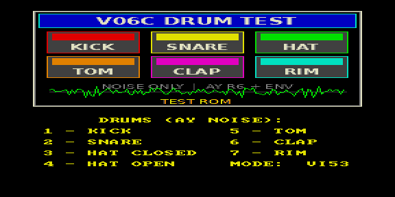

# drums — демо библиотеки ударных



Демо-ROM движка `lib/snd/drums.asm`: синтетические ударные на канале шума
AY-3-8910. Тоновые каналы при этом свободны для мелодии.

| Клавиша | Инструмент |
|---------|------------|
| 1 | Kick |
| 2 | Snare |
| 3 | Hat closed |
| 4 | Hat open |
| 5 | Tom |
| 6 | Clap |
| 7 | Rim |

Параметры каждого удара (огибающая, период шума, duty) заданы таблицей в начале
`drums.asm`. Маршрут шума переключается: AY Noise C либо Tape Out (PC0).

## Сборка

```bash
make          # собрать drums.rom
make deploy   # собрать + положить в ROMS эмулятора PPSSPP
make full     # clean + deploy
```

См. также [`../nes_drums`](../nes_drums) — 16 семплов барабанов NES.
