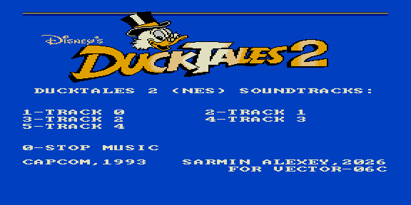

# ducktales2 — саундтрек DuckTales 2 (NES)



Музыкальный ROM: саундтрек из NES-игры **DuckTales 2** (Capcom, 1993).
Меню с выбором треков клавишами.

| Клавиша | Трек |
|---------|------|
| 1–5 | Track 0–4 |
| 0 | Стоп |

Пилотный проект сжатия партитур **ZX0**: треки хранятся в сжатом виде и
распаковываются в ОЗУ перед игрой (экономия места ROM).

## Варианты сборки

| ROM | Тон | Ударные |
|-----|-----|---------|
| `ducktales2.rom`    | КР580ВИ53 | Tape Out (PC0) |
| `ducktales2_ay.rom` | AY-3-8910 | Noise C |

## Сборка

```bash
make          # собрать ROM
make deploy   # собрать + положить в ROMS эмулятора PPSSPP
make full     # clean + deploy
```

Данные треков и конфигурация меню — в `rom.json`; общие правила — в
`../soundtracks/soundtrack.mk`.
