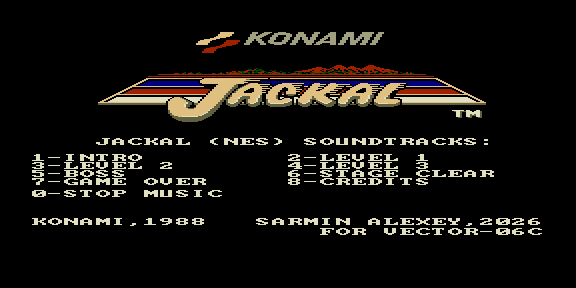

# jackal — саундтрек Jackal (NES)



Музыкальный ROM: саундтрек из NES-игры **Jackal** (Konami, 1988).
8 треков, выбор клавишами в меню.

| Клавиша | Трек |
|---------|------|
| 1 | Intro |
| 2–4 | Level 1–3 |
| 5 | Boss |
| 6 | Stage Clear |
| 7 | Game Over |
| 8 | Credits |
| 0 | Стоп |

Звук: 3 тональных канала КР580ВИ53 + ударные AY-3-8910 (Noise C), синхронно от
кадрового прерывания 50 Гц. Партитуры сжаты **ZX0**.

## Варианты сборки

| ROM | Тон | Ударные |
|-----|-----|---------|
| `jackal.rom`    | КР580ВИ53 | Tape Out (PC0) |
| `jackal_ay.rom` | AY-3-8910 | Noise C |

## Сборка

```bash
make          # собрать ROM
make deploy   # собрать + положить в ROMS эмулятора PPSSPP
make full     # clean + deploy
```

Данные треков и конфигурация меню — в `rom.json`; общие правила — в
`../soundtracks/soundtrack.mk`.
