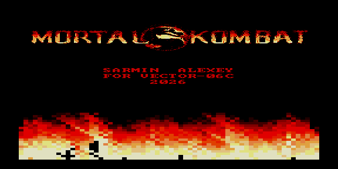

# mk — огонь + тема Mortal Kombat



Демо-ROM: движок огня из [`../../demos/fire2`](../../demos/fire2) (пламя внизу
экрана) плюс мелодия темы **Mortal Kombat**. Заголовок и титры выводятся
поверх фона.

Музыка: `music/theme.mus` (исходник, правится вручную) → `utils/mus2inc.py`
(`--use-shared nes_drums`) → `rom_data/theme.inc`. Конвертация из MIDI при сборке
отключена; `.mus` перегенерируют вручную из выбранного `assets/<midi>.mid`
(`theme`, `themeA`, `themeB`) — `make regen-mus THEME=<midi>`.

## Варианты сборки

| ROM | Тон | Ударные |
|-----|-----|---------|
| `mk.rom`    | КР580ВИ53 | Tape Out (PC0) |
| `mk_ay.rom` | AY-3-8910 | Noise C |

## Сборка

```bash
make          # собрать оба ROM
make clean    # убрать артефакты (сгенерированные .inc; .mus НЕ трогает)
make deploy   # собрать + положить в ROMS эмулятора PPSSPP
make full     # clean + сборка + deploy
make regen-mus# вручную перегенерировать music/theme.mus из выбранного MIDI
make regen-mus THEME=themeA  # то же из assets/themeA.mid (theme|themeA|themeB)
```
