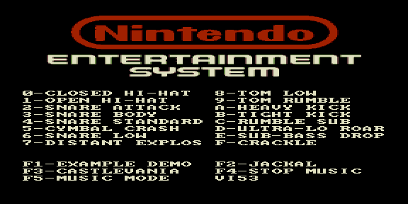

# nes_drums — библиотека шумовых инструментов NES



Тестовый ROM: 16 синтетических шумовых инструментов NES на AY-3-8910
(закрытый/открытый хэт, снейр, том, кик, тарелки, взрывы и т. д.) плюс
демо-записи.

| Клавиша | Действие |
|---------|----------|
| 0–9, A–F | запустить соответствующий семпл |
| F1 | EXAMPLE DEMO |
| F2 | JACKAL (демо-демонстрация на треке) |
| F3 | CASTLEVANIA |
| F5 | MUSIC MODE |

Семплы — пары (R6, R10) на кадр 50 Гц; генерируются `gen_samples.py`
(`make samples`). Общая семпловая база подключается к другим ROM через
`mus2inc.py --use-shared nes_drums`.

## Сборка

```bash
make          # собрать nes_drums.rom
make samples  # перегенерировать 16 семплов
make deploy   # собрать + положить в ROMS эмулятора PPSSPP
make full     # clean + deploy
```
