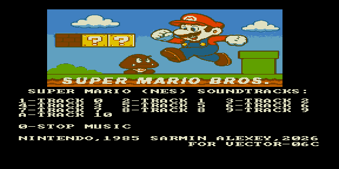

# supermario — саундтрек Super Mario Bros (NES)



Музыкальный ROM: саундтрек из NES-игры **Super Mario Bros** (Nintendo, 1985).
13 треков, выбор клавишами в меню.

| Клавиша | Трек |
|---------|------|
| 1–9 | Track 0–9 |
| A | Track 10 |
| 0 | Стоп |

Заставка — растровая сцена с Марио (RLE-картинка 256×256). Партитуры сжаты
**ZX0** и распаковываются в ОЗУ перед игрой.

## Варианты сборки

| ROM | Тон | Ударные |
|-----|-----|---------|
| `supermario.rom`    | КР580ВИ53 | Tape Out (PC0) |
| `supermario_ay.rom` | AY-3-8910 | Noise C |

## Сборка

```bash
make          # собрать ROM
make deploy   # собрать + положить в ROMS эмулятора PPSSPP
make full     # clean + deploy
```

Данные треков и конфигурация меню — в `rom.json`; общие правила — в
`../soundtracks/soundtrack.mk`.
