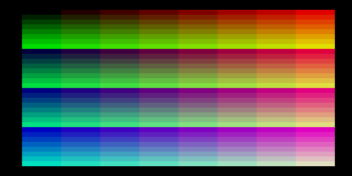

# clrs — реверс-инжиниринг оригинальной ROM `clrs.rom`



Проект восстановления исходников оригинальной демо-ROM «Вектора-06Ц» `clrs.rom`
(демонстрация смены палитры по строке развёртки — «гонка за лучом» с palette
raster). Снимок — экран пересобранного `clrs_new.rom`.

Этапы исследования задокументированы в отчётах [`reports/`](reports/)
(Stage1…Stage7), постановка — в [TZ.md](TZ.md).

## Результат

- `clrs_new.rom` — пересобранная байт-в-байт совместимая ROM;
- `clrs_new.asm`, `asm/` — восстановленный ассемблерный листинг;
- `.rdb` — база знаний отладчика (функции/метки/комментарии).

## Сборка

```bash
make          # собрать clrs_new.rom
make verify   # побайтовая сверка с оригиналом
```

Работа ведётся через MCP-отладчик `vector-debugger` (см. корневой
[README](../../../README.MD)).
