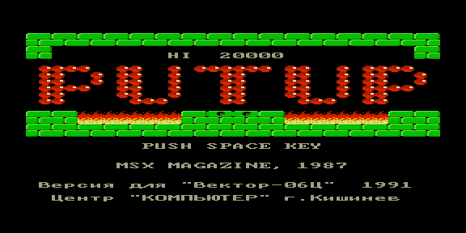

# putup — реверс-инжиниринг оригинальной игры `putup.rom`



Восстановление исходников оригинальной игры «Вектора-06Ц» **PUTUP**
(оригинал — MSX Magazine, 1987; порт для Вектора — Центр «Компьютер»,
г. Кишинёв, 1991). Аркада со «стеной» и счётчиком HI; в игре 15 уровней,
карта уровня 16×11 тайлов.

Снимок — экран заставки пересобранной ROM.

## Что восстановлено

- заставка с выводом текста на русском и английском (двойной шрифт, KOI8);
- главный игровой цикл, переменные состояния, вывод уровня по карте;
- мелодия заставки и драйвер звука через порты (выгружено в MIDI:
  `putup_title.mid`).

Этапы — в отчётах [`reports/`](reports/) (Stage1…Stage12), постановка —
[TZ.md](TZ.md), итоги — [AFTER.md](AFTER.md). Конвейер — `pipeline.json`.

## Сборка

```bash
make          # собрать восстановленную ROM
make verify   # побайтовая сверка с оригиналом
```
