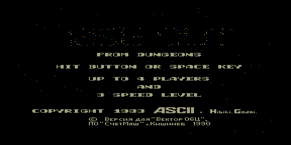

# riseout — реверс-инжиниринг оригинальной игры `riseout.rom`



Восстановление исходников оригинальной игры «Вектора-06Ц» **RISE OUT**
(порт аркады ASCI «From Dungeons», 1983; версия для Вектора — ПО «Счетмаш»,
г. Кишинёв, 1990). Заставка: до 4 игроков, выбор уровня скорости.

Образ 20480 байт, entry `0x0100`. В игре две мелодии (заставка и уровень),
обе выгружаются в MIDI: `riseout_title.mid`, `riseout_level.mid`.

> Для съёмки экрана заставки ROM нужно погонять ~10 секунд — заставка
> появляется не сразу.

Этапы — в отчётах [`reports/`](reports/) (Stage1…Stage10), постановка —
[TZ.md](TZ.md) и [TZ2.md](TZ2.md). Работает python-фреймворк
[`utils/analyze`](../../../utils/analyze/). Есть черновой `remake/`.

## Сборка

```bash
make          # собрать восстановленную ROM
make verify   # побайтовая сверка с оригиналом
```
