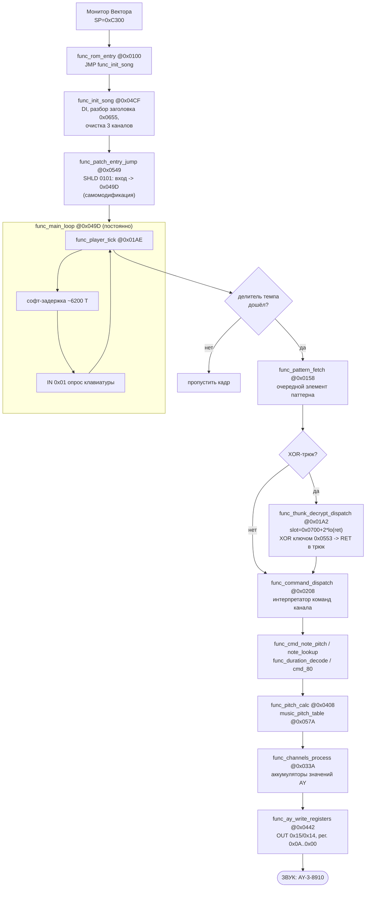

# TESTAY.ROM — описание алгоритма работы

> Итоговое описание по материалам Stage 1–3. Все факты получены через MCP `vector-debugger`
> (`debug_analyze_code`, `debug_disassemble_range`, `debug_read_memory_range`,
> `debug_get_io_trace`, снимки памяти). Источник имён/адресов — `src/TESTAY.rdb`.

## 1. Что это

**Однострочно:** TESTAY.ROM — автономный плеер музыки на звуковом чипе **AY-3-8910**
для Vector-06C. Чистый **i8080**, 3712 байта (0xE80), загружается по адресу **0x0100**.
Графики нет: видеопланы намеренно не заполняются (область 0xC2xx используется только как стек).

Программа представляет собой компактный **секвенсор-интерпретатор**: нотные потоки лежат в
памяти в сжатом/зашифрованном виде, а на каждом «тике» они расширяются, дешифруются и
преобразуются в значения регистров AY, которые пачкой пишутся в чип.

## 2. Точки взаимодействия с железом (Fact, по I/O-трассе)

| Порт | Направление | Назначение |
|---|---|---|
| `0x15` | OUT | Номер регистра AY (0x00–0x0A) |
| `0x14` | OUT | Значение выбранного регистра AY |
| `0x01` | IN | Опрос клавиатуры (всегда возвращает `0xEF`) |

Регистры AY: тон каналов A/B/C (0x00–0x05), noise (0x06), микшер (0x07), громкость каналов
(0x08–0x0A). Конверт (0x0D–0x0F) не используется. Каждый кадр регистры пишутся **пачкой в
обратном порядке 0x0A → 0x00**.

## 3. Логическая структура данных

| Область | Что |
|---|---|
| `0x0100–0x05FF` | код: инициализация, плеер, интерпретатор команд, вывод в AY |
| `0x0553` (12 Б) | `data_xor_key` — ключ инволютивной XOR-дешифровки трюков |
| `0x057A` (192 Б) | `music_pitch_table` — 96 16-битных периодов тона (0x0EF8..0x000F) |
| `0x0655` (7 Б) | `data_song_header` — темп + 3 абсолютных указателя на паттерны каналов |
| `0x066E`, `0x063A`, `0x065C` | таблицы параметров трека и служебные строки |
| `0x0700` (2090 Б) | `music_streams` — нотные потоки + XOR-трюки (зашифрованы) |
| `0x045E–0x049C` | рабочие переменные: базы паттернов, указатели потоков, счётчик темпа, состояние 3 каналов |

## 4. Алгоритм по шагам

### 4.1 Старт и инициализация (однократно)

1. Монитор/загрузчик Вектора выставляет `SP = 0xC300` и передаёт управление на `0x0100`.
2. `func_rom_entry` (`JMP func_init_song`).
3. `func_init_song` (0x04CF): `DI`; читает заголовок трека из `0x0657` (темп → `var_tempo`
   0x0466, три указателя паттернов → `var_pattern_base_A/B/C`); очищает таблицу состояния
   каналов `data_channel_state` (0x046F); инициализирует каналы.
4. В конце `func_init_song` вызывает `func_patch_entry_jump` (0x0549):
   `LXI H,049D / SHLD 0101 / PCHL` — **самомодификация**: переписывает операнд входного JMP
   по адресу `0x0101`, так что `0x0100` становится `JMP func_main_loop`. Дальше вход из
   монитора (`RESET`/рестарт) идёт сразу в главный цикл, минуя инициализацию.
5. `PCHL` — переход в `func_main_loop` (0x049D).

### 4.2 Главный цикл (0x049D, крутится постоянно)

На каждой итерации:

1. **Тик плеера** — `func_player_tick` (0x01AE).
2. **Софт-задержка** (петля в 0x04A1–0x04A9) — задаёт кадровый темп (~6200 T-состояний).
3. **Опрос клавиатуры** — `IN 0x01; RAL; JC` (обычно флаг не взведён → продолжаем цикл).
4. Прыжок обратно в начало цикла.

### 4.3 Тик плеера `func_player_tick`

1. Делитель темпа: `LDA var_tempo_counter / DCR / STA` — играет не каждый кадр, а раз в `tempo` тиков.
2. Когда делитель обнулился — продвижение и обработка **трёх каналов** по очереди:
   - `func_pattern_fetch` (0x0158) — загрузить очередной элемент паттерна, обновить указатель потока;
   - при встрече зашифрованного трюка — `func_thunk_decrypt_dispatch` (0x01A2);
   - `func_command_dispatch` (0x0208) — интерпретатор команд канала;
   - `func_channels_process` (0x033A) — досчитать состояние каналов и собрать значения AY.

### 4.4 Дешифровка нотных потоков (XOR-трюки)

Потоки в `music_streams` лежат зашифрованными. Механизм:

1. `func_thunk_slot_addr` (0x055F) вычисляет адрес 12-байтного слота как
   `0x0700 + 2 * (младший байт адреса возврата)` и кладёт его в `DE`.
2. `func_xor_decrypt_loop` (0x056A) инволютивно **XOR**'ит эти 12 байт ключом `data_xor_key`
   (0x0553) и делает `RET`, передавая управление уже **расшифрованному** трюку-обработчику.
3. Из-за инволютивности XOR те же байты при следующем прогоне шифруются обратно — поэтому
   «дельта памяти = 0» не означает «нет записей» (важная ловушка анализа).

### 4.5 Интерпретатор команд `func_command_dispatch`

Разбирает байт-код паттерна по диапазонам (`CPI` 0x60/0x70/0x80/0x81/0x82/0x8F):

| Код | Обработчик | Действие |
|---|---|---|
| `< 0x60` | `func_cmd_handler_60` | записать значение в поток |
| `0x60–0x6F` | `func_cmd_note_pitch` | нота: поиск высоты по pitch-таблице канала |
| `0x70–0x7F` | `func_cmd_sui70` → `func_note_lookup` | нота/длительность (шаг 0x21) |
| пауза | `func_cmd_rest` | пометить канал «тишина» ([поток+7]=0xFF) |
| `0x80–0x8E` | `func_cmd_80` | смена параметров канала |
| `0x81` (выход) | `func_cmd_retn_inx` | `INX H; RET` |

Высота тона переводится в период таблицей `music_pitch_table` через `func_pitch_calc` (0x0408);
длительность разбирает `func_duration_decode` (0x02C3); громкость хранит `func_vol_store`.

### 4.6 Вывод в чип `func_ay_write_registers` (0x0442)

Собранные за тик значения трёх каналов (периоды тона, noise, микшер, громкости)
записываются в AY: цикл по регистрам `0x0A → 0x00`, для каждого — `OUT 0x15` (номер) +
`OUT 0x14` (значение). Это единственный «выход» всей программы — звук.

## 5. Блок-схема

## 6. Три «изюминки», важных для понимания

1. **Самомодифицирующийся вход.** Инициализация выполняется один раз; её итог — подмена
   `JMP` по адресу `0x0101`, после чего повторный вход идёт сразу в главный цикл. Из-за этого
   дизассемблирование из RAM расходится с байтами файла (`JMP 049D` против `JMP 04CF`).
2. **Инволютивная XOR-дешифровка потоков** с адресом слота, привязанным к адресу возврата, —
   и защита от копирования, и причина «нулевых дельт» на снимках памяти.
3. **Пачечная запись регистров AY в обратном порядке** как единственный видимый/слышимый
   результат работы — вся остальная программа лишь готовит эти значения.

## 7. Связь с Stage 3

ROM **нерелоцируем**: абсолютные адреса в заголовке трека и привязка XOR-слотов к адресам
возврата связывают код с данными. Поэтому перенос стека `0xC300 → 0x8000` в `TESTAY_NEW.ROM`
сделан не вставкой пролога, а **размерно-нейтральным патчем на месте** в
`func_patch_entry_jump` (`LXI SP,08000h / JMP func_main_loop / NOP`), меняющим ровно 7 байт.
