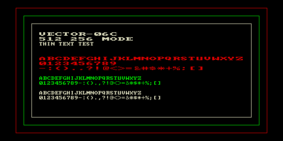

# 512x256 — тест тонкого текста в режиме 512×256



Тестовый ROM библиотеки `lib/gfx`: вывод текста тонким шрифтом 4×8 в
графическом режиме 512×256 (`gfx_print_512t`, `pr512t.asm`). На экране —
алфавит, цифры и спецсимволы, продублированные в 4 цветах режима; рамка
демонстрирует разделение на плоскости.

Используемые модули: `mode.c`, `clr.asm`, `fstride.asm`, `pr512.asm`,
`pr512t.asm`.

## Сборка

```bash
make          # собрать 512x256.rom
make deploy   # собрать + положить в ROMS эмулятора PPSSPP
make full     # clean + deploy
```
