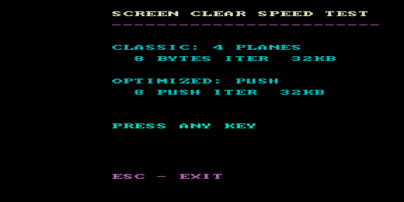

# cls — тест скорости очистки экрана



Тестовый ROM `lib/gfx`: сравнение двух способов очистки 32 КБ VRAM.

- **CLASSIC** — классический обход 4 плоскостей по 8 байт за итерацию;
- **OPTIMIZED: PUSH** — заполнение через `PUSH` (по 8 байт за инструкцию).

ROM измеряет и показывает стоимость каждого метода. Любая клавиша перезапускает
замер, **ESC** — выход.

## Сборка

```bash
make          # собрать cls.rom
make deploy   # собрать + положить в ROMS эмулятора PPSSPP
make full     # clean + deploy
```
