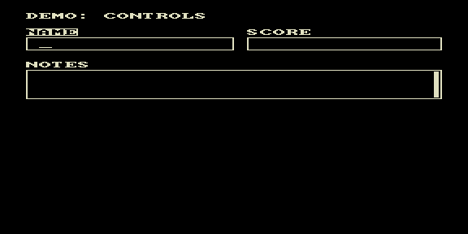

# controls — демо UI-компонентов



Тестовый ROM библиотеки `lib/comps`: демонстрация компонентов ввода —
`controller` (маршрутизация фокуса и клавиш), `edit` (однострочное поле) и
`textarea` (многострочное поле с прокруткой). На экране — форма «DEMO:
CONTROLS» с полями NAME, SCORE и NOTES; подчёркивание-курсор мигает в
активном поле, переход между полями по TAB.

Используется частичная перерисовка: поле обновляется только при изменении
состояния/фокуса.

## Сборка

```bash
make          # собрать controls.rom
make deploy   # собрать + положить в ROMS эмулятора PPSSPP
make full     # clean + deploy
```
