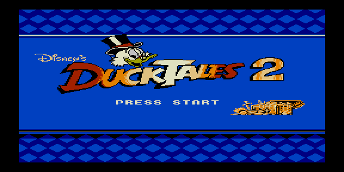

# dt2 — тест RLE-картинки 256×256



Тестовый ROM распаковщика `lib/unpack/rle.asm`: вывод растровой картинки
256×256, 16 цветов из RLE-потока. Заготовка — DuckTales 2 (логотип). Поток
генерирует `utils/bmp2inc.py` из BMP с настоящей векторной палитрой.

Формат RLE: заголовок (ширина в 8-пиксельных блоках + высота), далее пары
(длина, байт), терминатор — длина 0; пробег может пересекать границы блоков и
плоскостей.

## Сборка

```bash
make          # собрать dt2.rom (генерирует .inc из BMP)
make deploy   # собрать + положить в ROMS эмулятора PPSSPP
make full     # clean + deploy
```

См. также [`../dt2_512`](../dt2_512) (512×256, 2 цвета) и
[`../dt2_lz`](../dt2_lz) (LZ-тайловая распаковка).
