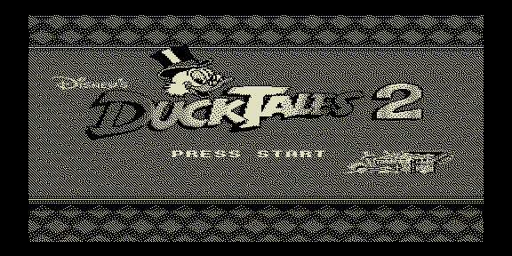

# dt2_512 — тест картинки 512×256 (2 цвета)



Тестовый ROM распаковщика `lib/unpack/rle512.asm`: вывод двухцветной картинки
в режиме 512×256. Заготовка — DuckTales 2; полутона переданы дизерингом
(чередование пикселей двух активных плоскостей `0xE000` + `0xA000`).

Поток содержит данные обеих плоскостей: первые 32 блока → плоскость 1
(`0xA000`), следующие 32 → плоскость 0 (`0xE000`); заголовок (64, высота).
Инкремп-файл генерирует `utils/bmp2inc512.py`.

## Сборка

```bash
make          # собрать dt2_512.rom
make deploy   # собрать + положить в ROMS эмулятора PPSSPP
make full     # clean + deploy
```
