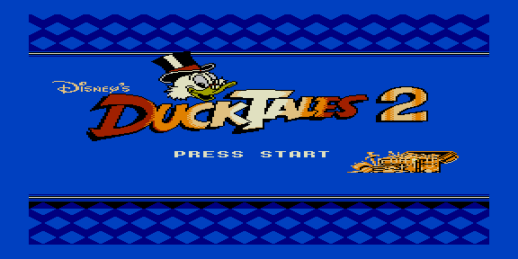

# dt2_lz — тест LZ-тайловой распаковки



Тестовый ROM распаковщика `lib/unpack/lz.asm`: вывод картинки 256×256 из
LZ-потока тайлов. Заготовка — DuckTales 2 (как в [`../dt2`](../dt2), но со
сжатием тайловым словарём вместо RLE).

Формат: заголовок (tpp, ntiles, h/8), словарь `ntiles × 8` байт, затем четыре
LZ-потока (по одному на бит-плоскость); литерал — 9-битный индекс словаря,
ссылка — 12-битное смещение + 4-битная длина. Поток генерирует
`utils/bmp2inc_lz.py`.

## Сборка

```bash
make          # собрать dt2_lz.rom
make deploy   # собрать + положить в ROMS эмулятора PPSSPP
make full     # clean + deploy
```
