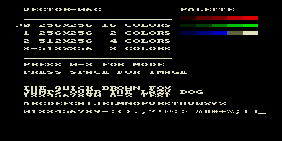

# scr_modes — тест переключения видеорежимов



Тестовый ROM `lib/gfx`: переключение четырёх графических режимов и проверка
вывода текста/палитры в каждом.

| Клавиша | Режим |
|---------|-------|
| 0 | 256×256, 16 цветов |
| 1 | 256×256, 2 цвета |
| 2 | 512×256, 4 цвета |
| 3 | 512×256, 2 цвета |

**SPACE** — показать картинку. На экране — список режимов, образцы палитры
(справа) и полный набор глифов шрифта: панграмма, цифры, заглавные/строчные,
спецсимволы. Проверяются `gfx_set_mode`, `gfx_set_palette`, `pr.asm`,
`pr512.asm`, `pr512t.asm`.

## Сборка

```bash
make          # собрать scr_modes.rom
make deploy   # собрать + положить в ROMS эмулятора PPSSPP
make full     # clean + deploy
```
