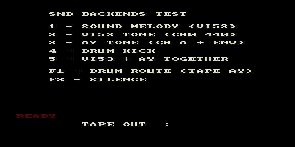

# snd_backends — тест разделения аудиомодулей



Тестовый ROM: в одном образе линкуются оба аппаратных модуля вывода —
`vi53.c` (КР580ВИ53) и `ay.c` (AY-3-8910), плюс шаговый плеер `sound.c` и
ударные `drums.asm`. Проверяет, что `vi53_*` и `ay_*` работают независимо и
одновременно.

| Клавиша | Тест |
|---------|------|
| 1 | Sound melody (VI53) |
| 2 | VI53 tone (CH0, 440 Гц) |
| 3 | AY tone (CH A + envelope) |
| 4 | Drum kick |
| 5 | VI53 + AY together |
| F1 | Drum route (Tape / AY) |
| F2 | Silence |

Внизу экрана — текущий маршрут ударных (TAPE OUT / AY) и статус READY.

## Сборка

```bash
make          # собрать snd_backends.rom
make deploy   # собрать + положить в ROMS эмулятора PPSSPP
make full     # clean + deploy
```
