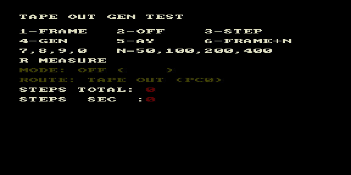

# tape_test — тест генерации шума Tape Out



Тестовый ROM гибкой генерации шума на Tape Out (PIA Port C, бит 0). Проверяет
трёхслойное разделение `drums.asm`: drum engine / output route / scheduler.

| Клавиша | Режим |
|---------|-------|
| 1 | FRAME — генерация из прерывания кадра |
| 2 | OFF |
| 3 | STEP — `drum_tape_step()` из main loop |
| 4 | GEN — `drum_tape_generate(n)` |
| 5 | AY — маршрут AY Noise |
| 6 | FRAME+N — кадр + фикс. порог шагов |
| 7,8,9,0 | N = 50, 100, 200, 400 шагов/тик |
| R | MEASURE |

Внизу — текущий режим, маршрут (TAPE OUT PC0) и счётчики STEPS TOTAL / STEPS
SEC. Демонстрирует, что шаги LFSR/сек ≠ число переключений PC0 ≠ воспринимаемая
частота шума.

## Сборка

```bash
make          # собрать tape_test.rom
make deploy   # собрать + положить в ROMS эмулятора PPSSPP
make full     # clean + deploy
```
